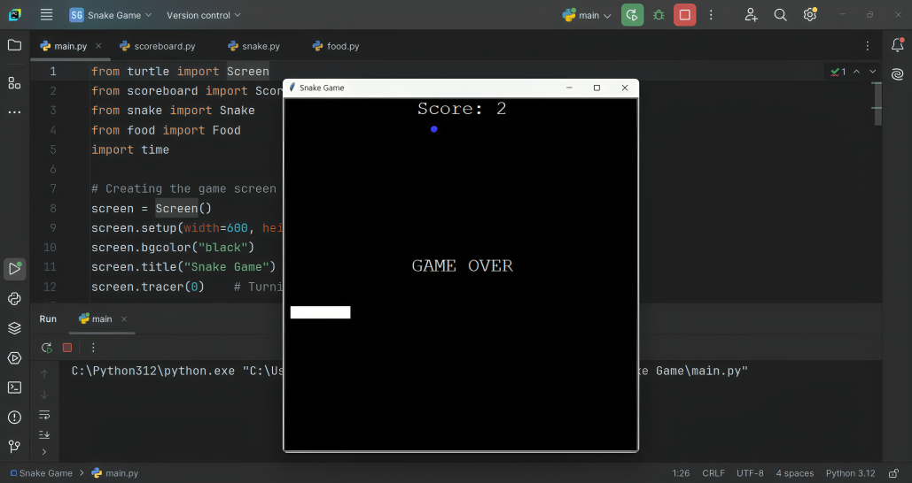

# 🐍 Classic Snake Game in Python Turtle

Welcome to the **Snake Game**, a modern twist on the nostalgic classic—rebuilt using Python’s `turtle` module! 🎮
This project is an excellent way to explore Python’s object-oriented programming (OOP), interactive screen updates, and event-driven design.

## 🚀 Features

✅ Smooth and responsive snake movement  
✅ Randomly spawning food with collision handling  
✅ Self and wall collision detection with auto game reset  
✅ Real-time scoring system with a scoreboard  
✅ Modular, clean code using OOP design

## 📂 Project Structure

```bash
📦 Snake Game
├── main.py          # Main game loop and screen control
├── snake.py         # Snake class – movement and growth logic
├── food.py          # Food class – random placement and appearance
├── scoreboard.py    # Scoreboard class – score update and game over
├── README.md        # Project documentation
└── screenshot.png   # Preview of the game screen
```

## 🎮 Gameplay Instructions

1. Run `main.py`
2. Use the arrow keys to navigate the snake:
   - ⬆️ Up
   - ⬇️ Down
   - ⬅️ Left
   - ➡️ Right
3. Eat food to grow longer and increase your score
4. Avoid colliding with the walls or yourself!

## 🛠️ Built With

- Python 3.x
- `turtle` graphics module (built-in)

## 📷 Screenshot




## 🧠 Key Concepts Demonstrated

- Object-Oriented Programming
- Class Composition and Inheritance
- Event Listeners & Keyboard Binding
- Real-Time Game Loop Execution
- Random Module & Coordinate Management


---

### 💬 Feedback is Welcome!
Have improvements or ideas? Feel free to raise an issue or contribute via pull request.

---

### 👨‍💻 Developed By

**Saurabh Kulshrestha**

